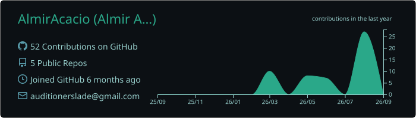
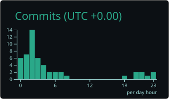
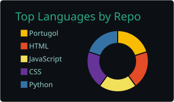
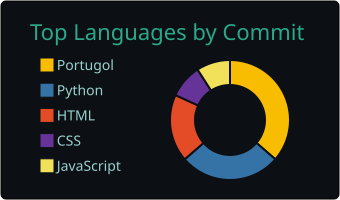
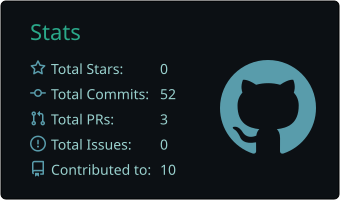

# 💻 Almir Acacio Vilaça Filho

**`Desenvolvedor Fullstack`**

Olá! Meu nome é Almir Acacio Vilaça Filho, tenho 40 anos, moro em Petrópolis e sou natural do estado do Rio de Janeiro (RJ).
Trabalhei por 15 anos como um Operador de Hipermercado nas redes Sendas e Extra (2009-2024) e no momento estou em transição de carreira para a área de Programação, onde me formei recentemente na Residência em TIC/Software pela Serratec (Março a Julho de 2026), através de um curso técnico oferecido pela Firjan/SENAI. Tenho muito gosto pela área de informática e tecnologia, na qual gostaria muito de trabalhar, especialmente nas áreas de Análise de Sistemas e Dados, Cybersegurança e Desenvolvimento de Softwares. Sigo sempre estudando e aprimorando meus conhecimentos!

 

    
    

---

### ⚙️ Linguagens e Tecnologias

 

 

### 📊 Estatísticas:

 

<table border="0">
    <tr>
        <td>
            
        </td>
        <td>
            
        </td>
        <td>
            
        </td>
    </tr>
    <tr>
        <td>
            
        </td>
        <td>
            
        </td>
    </tr>
</table>
